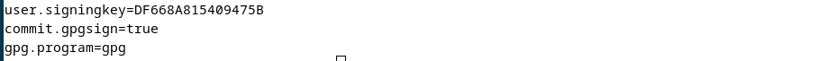
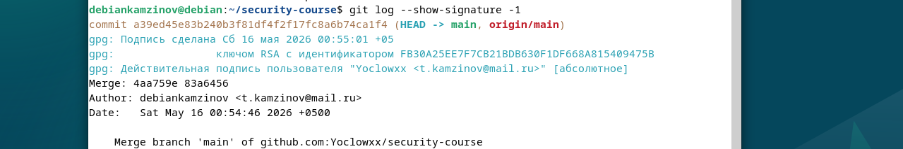

# ПР №5. GPG, подпись коммитов и безвозвратное удаление

## 1. GPG-ключевая пара

- Key-ID: DF668A815409475B
- Тип: RSA 4096 бит
- Email: t.kamzinov@mail.ru
- Размер публичного ключа: 30 строк

**Что означает флаг --armor:** 
Преобразует двоичные данные (ключ, шифротекст, подпись) в текстовый формат ASCII (так называемый "ASCII-armor"). Это позволяет вставлять ключ в письмо, публиковать на сайте или копировать через буфер обмена без искажения управляющих символов.

## 2. Шифрование

**Зашифрованный файл (первые 5 строк):**

-----BEGIN PGP MESSAGE-----
hQIMA/pSG2zx1rxPARAAuUZXxs7v+DD2m27G2u9/D9HCsTdHfIOfmL8doktPrJBK
i0okY+gshf884IGL5uJjwnh/npS579YFOEltsvkJM9CFKh+YDL0tvp/qEdZ38Y2v
KKIwqhcxA5PL77SKfMVG1/+G9HJkWXfg1xw4+oEPs7ZjbnL5HPsIRoPe5vUDrgVT
cT4oBEbORrAvd11WzhC9wY75YkVek0XMBBtcCC5+sWPCjQgMTJWgC01oTDP3Hz3
Ji18RV5s4hc8xd95O14w2T7XYMqDfsNhoaouEsud7w88dwQsmdHbmgi7NeKwrciR

**Можно ли прочитать исходные данные из зашифрованного файла:** 
Нет, без приватного ключа содержимое представляет собой нечитаемый набор символов.

**Что произойдёт если ввести неверный пароль при расшифровке:** 
gpg выдаст ошибку аутентификации (например, "decryption failed: Bad session key" или "gpg: public key decryption failed: Bad passphrase") и не выведет исходные данные.

**Почему нельзя расшифровать файл зашифрованный для другого пользователя:** 
Шифрование выполняется на открытом ключе получателя. Расшифровать данные может только владелец соответствующего закрытого ключа. У другого пользователя нет нужного приватного ключа.

## 3. Цифровая подпись

**Вывод gpg --verify (Good signature):**

gpg: Подпись сделана Сб 16 мая 2026 00:30:18 +05
gpg: ключом RSA с идентификатором FB30A25EE7F7CB21BDB630F1DF668A815409475B
gpg: Действительная подпись пользователя "Yoclowxx <t.kamzinov@mail.ru>" [абсолютное]

**Вывод gpg --verify после изменения файла (BAD signature):**

gpg: Подпись сделана СБ 16 мая 2026 00:30:18 +05
gpg: ключом RSA с идентификатором FB30A25EE7F7CB21BDB630F1DF668A815409475B
gpg: ПЛОХАЯ подпись пользователя "Yoclowxx <t.kamzinov@mail.ru>" [абсолютное]

**Почему подпись перестала быть действительной после изменения файла:** 
Цифровая подпись вычисляется от хеша содержимого файла. При любом изменении файла (даже добавлении одного символа) хеш меняется, и проверка подписи завершается ошибкой.

**Что именно проверяет gpg --verify:** 
Проверяет, что подпись создана указанным приватным ключом, а содержимое файла не было изменено после подписания.

## 4. Подпись коммитов

**Ссылка на коммит:** 
https://github.com/Yoclowxx/security-course/commit/4aa759eb1f9fce2180cf00f9f5b1e4a3b2ba42eb

**Вывод git log --show-signature -1:**

commit a39ed45e83b240b3f81df4f2f17fc8a6b74ca1f4 (HEAD -> main, origin/main)
gpg: Подпись сделана СБ 16 мая 2026 00:55:01 +05
gpg: ключом RSA с идентификатором FB30A25EE77FCB21BDB630F1DF668A815409475B
gpg: Действительная подпись пользователя "Yoclowxx <t.kamzinov@mail.ru>" [абсолютное]
Merge: 4aa759e 83a6456
Author: debiankamzinov <t.kamzinov@mail.ru>
Date: Sat May 16 00:54:46 2026 +0500

    Merge branch 'main' of github.com:Yoclowxx/security-course

**Зачем проверять подпись локально если GitHub уже показывает Verified:** 
- GitHub полагается на веб-интерфейс и может ошибаться при проблемах с синхронизацией ключей.
- Локальная проверка не зависит от GitHub и работает даже офлайн.
- Подтверждает, что коммит действительно подписан вашим ключом, а не украденным токеном доступа к аккаунту.

## 5. rm vs shred

| Операция | Что происходит с данными на диске | Можно восстановить? |
|----------|----------------------------------|---------------------|
| rm       | Удаляется только запись в метаданных (inode), данные остаются на диске до перезаписи | Да, специальными утилитами (testdisk, photorec) |
| shred    | Содержимое блоков многократно перезаписывается случайными данными (по умолчанию 3 прохода) | Практически нет |

**Сценарий когда нужно затирать свободное место:** 
- Перед утилизацией или продажей жёсткого диска / ноутбука.
- На компьютере с секретными данными (например, работа с гостайной, финансовые отчёты, медицинские данные).
- После удаления паролей, ключей шифрования или личной переписки.

## Выводы

В ходе работы я:

1. Создал GPG-ключевую пару RSA 4096 и изучил её структуру.
2. Научился шифровать файлы с помощью --encrypt --armor --recipient и расшифровывать их закрытым ключом.
3. Освоил создание и проверку цифровых подписей (--sign, --verify). Убедился, что изменение файла делает подпись недействительной.
4. Настроил подпись коммитов в Git (user.signingkey, commit.gpgsign=true) и проверил отображение "Verified" на GitHub.
5. Сравнил безопасное удаление rm (только удаление записи) и shred (физическая перезапись данных).

## Контрольные вопросы
68.В чём разница между шифрованием и подписью? Можно ли одновременно зашифровать и подписать файл?

Шифрование скрывает содержимое от посторонних и использует публичный ключ получателя. Подпись подтверждает авторство и целостность и использует приватный ключ отправителя. Одновременно зашифровать и подписать файл можно командой: gpg --encrypt --sign --recipient t.kamzinov@mail.ru secrets.txt

69.Почему публичный ключ можно раздавать всем, а приватный нельзя никому?

Публичный ключ предназначен для шифрования и проверки подписей, он не позволяет расшифровать данные или создать подпись. Приватный ключ даёт полный контроль: расшифровку и создание подписей от вашего имени. Если приватный ключ попадёт к другому человеку, он сможет подписываться за вас.

70.Что произойдёт с зашифрованными данными если потерять приватный ключ?

Данные навсегда останутся зашифрованными. Расшифровать их невозможно даже автору. Поэтому приватные ключи нужно хранить в безопасном месте и делать резервные копии.

71.Можно ли подделать Verified коммит на GitHub не имея приватного GPG-ключа владельца?

Нет. GitHub проверяет подпись коммита публичным ключом, загруженным в аккаунт. Без приватного ключа нельзя создать подпись, которую GitHub признает верифицированной. Можно подделать только локальное отображение, но при пуше на GitHub подпись не пройдёт проверку.

72.Почему shred плохо работает на SSD? Что использовать вместо него?

shred плохо работает на SSD потому что у SSD есть контроллер с выравниванием износа (wear leveling) и команда TRIM. Когда shred перезаписывает данные, контроллер может записать новые данные в другую физическую ячейку, а старые останутся в чипе. Вместо shred на SSD используют: аппаратное шифрование (LUKS) с последующим удалением ключа, команду blkdiscard, утилиты производителя (Secure Erase) или nvme format для NVME дисков.

73.Коллега говорит: «я отформатировал диск перед продажей — всё безопасно». Он прав?

Нет, не прав. Обычное (быстрое) форматирование удаляет только таблицу разделов, данные остаются на диске и восстанавливаются утилитами (testdisk, photorec). Даже полное форматирование на HDD не гарантирует безвозвратное удаление. Правильный подход: перезапись данными (shred, dd) или Secure Erase для SSD.

74.Чем отличается detach-sign (--detach-sign) от встроенной подписи (--sign)?

При встроенной подписи (gpg --sign file.txt) получается один файл (file.txt.gpg) с данными и подписью внутри. При отдельной подписи (gpg --detach-sign file.txt) получается два файла: исходный file.txt и отдельный файл подписи file.txt.sig. Отдельную подпись используют при распространении ISO образов, установочных файлов или исполняемых программ, чтобы данные оставались в исходном виде, а подпись шла отдельным файлом.
