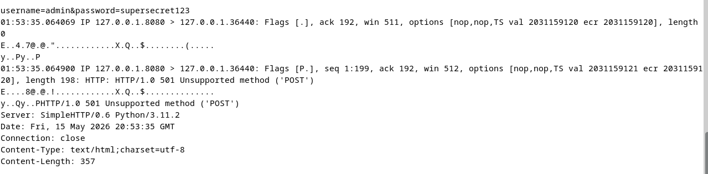
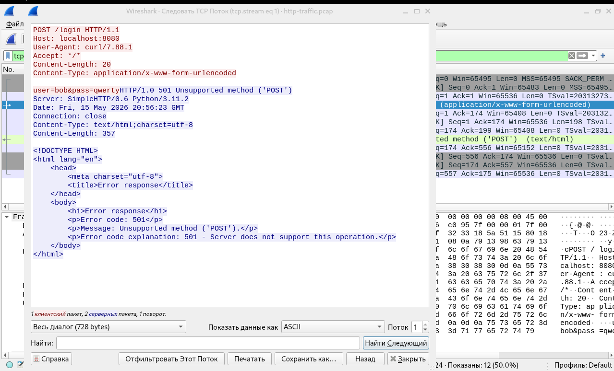

# ПР №6. Анализ сетевого трафика: tcpdump и Wireshark

## 1. Разбор строки tcpdump

Строка: `12:34:56.789012 IP 127.0.0.1.44321 > 127.0.0.1.8080: Flags [S], seq 123, length 0`

| Поле | Значение | Что означает |
|------|---------|-------------|
| 12:34:56.789012 | Время захвата | Точное время в формате ЧЧ:ММ:СС.микросекунды |
| IP | Протокол | Используется протокол IPv4 |
| 127.0.0.1.44321 | Адрес источника | IP-адрес 127.0.0.1 (localhost) и порт отправителя 44321 |
| 127.0.0.1.8080 | Адрес назначения | IP-адрес 127.0.0.1 и порт получателя 8080 |
| > | Направление | Пакет отправлен от источника к назначению |
| Flags [S] | TCP-флаги | SYN — флаг установки соединения (начало TCP handshake) |
| length 0 | Длина данных | В пакете нет полезной нагрузки, только заголовки |

---

## 2. Перехваченные данные HTTP



**Что видно в трафике:** 
В перехваченном HTTP-трафике видно тело POST-запроса с передачей логина и пароля в открытом виде: 
`username=admin&password=supersecret123` (файл 3.png) 
Также в файле 9.png видна строка авторизации в Base64: `dmFzeWE6TXlQYXNzd29yZDIwMjQ=` и пароль `MyPassword2024` 
Сервер отвечает ошибкой `501 Unsupported method`, так как простой HTTP-сервер Python не поддерживает POST.

**Кто в реальной сети может так же прочитать этот трафик:** 
Любой, кто имеет доступ к сегменту сети между клиентом и сервером:
- Злоумышленник в той же Wi-Fi сети
- Администратор маршрутизатора или коммутатора
- Интернет-провайдер
- Владелец публичной точки доступа

**Вывод:** HTTP не обеспечивает никакой конфиденциальности — логины и пароли передаются в открытом виде.

---

## 3. Follow TCP Stream



**Что видит злоумышленник, перехвативший этот трафик:** 
С помощью функции **Follow TCP Stream** в Wireshark злоумышленник видит полный диалог между клиентом и сервером (файл 7.png):
- Полный HTTP-запрос клиента: `POST /login HTTP/1.1` с телом `user=Bob&pass=qwerty`
- Весь ответ сервера: статус `501`, заголовки и HTML-страница с ошибкой
- Все пакеты собираются в единый поток, очищаясь от TCP-заголовков, ACK и служебной информации

**Вывод:** Функция Follow TCP Stream в Wireshark позволяет злоумышленнику восстановить полную картину обмена данными.

---

## 4. HTTP vs HTTPS — сравнение

| Что наблюдаем | HTTP | HTTPS |
|---|---|---|
| IP-адреса | Видны | Видны (файл 10.png) |
| Заголовки | Видны полностью (файлы 1.png, 2.png) | Скрыты внутри шифрованного TLS |
| Тело запроса | Видно полностью | Скрыто шифрованием (файл 10.png — бинарные данные) |
| Логин/пароль | Видны в открытом виде (файлы 3.png, 7.png, 9.png) | Скрыты |
| Имя домена | Видно в поле Host | Видно в SNI или DNS-запросах (файл 11.png) |

**Вывод:** HTTPS шифрует содержимое, но метаданные (IP, DNS, SNI) остаются видимыми.

---

## 5. DNS и приватность

**Какие домены видны в DNS даже при HTTPS (файл 11.png):** 
- `sr-client-cfg.amplitude.com`
- `github.com`
- `example.com`
- `google.com`
- `stats.steamInventoryhelper.com`
- `p2p-sto2.discovery.steamserver.net`

**Что это означает для приватности:** 
Даже при HTTPS DNS-трафик ходит в открытом виде. Любой в сети видит, какие сайты посещает пользователь.

**Вывод:** DNS — слабое место приватности. Нужен DoH или DoT.

---

## 6. Base64

**Декодированная строка (файлы 12.png, 13.png):** 
`dmFzeWE6TXlQYXNzd29yZDIwMjQ=` → **`vasya:MyPassword2024`**

Пример из файла 13.png:
```
echo -n 'mylogin:mypassword' | base64
Результат: bXlsb2dpbjpteXBhc3N3b3Jk
```

**Почему Base64 не является шифрованием:** 
- Нет ключа — любой может декодировать
- Это кодировка, а не шифрование
- Алгоритм полностью обратим

**Вывод:** Base64 создаёт ложное чувство безопасности. Это не защита.

---

## 7. tshark vs tcpdump

| Инструмент | Когда использовать | Пример из работы |
|---|---|---|
| tcpdump | Быстрый захват на сервере, работа по SSH | Файлы 1.png, 2.png, 10.png, 11.png |
| tshark | Анализ .pcap файлов, фильтрация, статистика | Файлы 4.png, 14.png |
| Wireshark | Глубокий визуальный анализ, Follow Stream | Файлы 5.png, 6.png, 7.png, 8.png |

**Вывод:** tcpdump — для захвата, tshark — для анализа в консоли, Wireshark — для визуального анализа.

---

## 8. Каналы утечки через сеть

**Основные каналы утечки:**
- HTTP (открытый текст) — файлы 1.png, 2.png, 3.png, 7.png, 9.png
- DNS-запросы — файл 11.png
- ICMP — файл 1.png

**Меры защиты:**
- HTTPS/TLS — шифрует содержимое
- DoH/DoT — скрывает DNS
- VPN — шифрует весь трафик
- Tor — анонимизация
- ESNI/ECH — скрывает SNI

---

## Выводы

1. **HTTP небезопасен.** Пароли (`supersecret123`, `MyPassword2024`, `qwerty`) перехвачены в открытом виде.

2. **HTTPS скрывает содержимое, но не метаданные.** IP, DNS, SNI остаются видимыми.

3. **Base64 — не шифрование.** Это кодировка, которую любой декодирует за секунду.

4. **DNS — слабое место.** Даже при HTTPS видны все посещаемые домены.

5. **Инструменты:** tcpdump (захват), tshark (анализ), Wireshark (глубокий анализ).

6. **Комплексная защита:** HTTPS + DoH + VPN + ESNI.


## Контрольные вопросы

**78. Что такое promiscuous mode и зачем он нужен снифферу?** 
Promiscuous mode (неразборчивый режим) — режим работы сетевого интерфейса, при котором он принимает **все пакеты** в сегменте сети, а не только адресованные его MAC-адресу. Снифферу нужен для перехвата чужого трафика (например, HTTP-паролей из файлов `3.png`, `7.png`, `9.png`).

**79. Чем отличается capture filter от display filter в Wireshark?** 
- **Capture filter** — фильтрует пакеты **ДО** захвата (не сохраняет их в файл). Синтаксис как у tcpdump (BPF). 
- **Display filter** — фильтрует **ПОСЛЕ** захвата (только скрывает из отображения). Синтаксис Wireshark. 
Пример из файла `4.png`: `tshark -r http-traffic.pcap -Y 'http.request.method == "POST"'` — это display filter.

**80. Что такое Follow TCP Stream и для чего используется?** 
Функция Wireshark, которая собирает все пакеты одной TCP-сессии в единый поток данных (файл `7.png`). Используется для восстановления полного диалога клиента и сервера — например, чтобы увидеть весь HTTP-запрос и ответ целиком.

**81. Почему Base64 в HTTP Basic Auth не является защитой? Что нужно использовать вместо?** 
Base64 — это **кодировка**, а не шифрование. У неё нет ключа, любой может декодировать строку (пример в файлах `12.png`, `13.png`: `dmFzeWE6TXlQYXNzd29yZDIwMjQ=` → `vasya:MyPassword2024`). 
Вместо Base64 нужно использовать **HTTPS** (TLS-шифрование).

**82. Какие данные утекают даже при использовании HTTPS? Как это исправить?** 
Даже при HTTPS утекают: 
- IP-адреса источника и назначения (файл `10.png`) 
- DNS-запросы (файл `11.png` — видны все посещаемые домены) 
- SNI (имя сервера при TLS-рукопожатии) 
- Размеры пакетов и временные метки 

**Как исправить:** 
- DoH/DoT (DNS over HTTPS/TLS) — скрыть DNS-запросы 
- VPN/Tor — скрыть IP-адреса 
- ESNI/ECH — скрыть SNI 

**83. Сисадмин говорит: «у нас свитч, а не хаб — значит сниффинг невозможен». Он прав?** 
**Не прав.** На свитче сниффинг возможен с помощью: 
- ARP-spoofing (отравление ARP-таблиц) 
- Port mirroring (SPAN) на самом свитче 
- Tap-адаптеров 
Свитч затрудняет сниффинг, но не делает его невозможным.

**84. Напишите фильтр tcpdump который перехватывает только DNS-запросы (UDP порт 53) от конкретного IP 192.168.1.50.** 
```bash
sudo tcpdump -i eth0 'udp port 53 and src host 192.168.1.50'
