# ПР №7. AppArmor, Capabilities и Docker

## 1. Linux Capabilities

### Разбор getcap /usr/bin/ping
cap_net_raw=ep: 
- `cap_net_raw` — привилегия ядра Linux, позволяющая процессу использовать сырые сокеты (RAW/ICMP), что необходимо для работы утилиты `ping`
- `e` (Effective) — привилегия активируется автоматически сразу при запуске файла
- `p` (Permitted) — задаёт максимальный набор прав, которые этот файл или процесс имеет право использовать

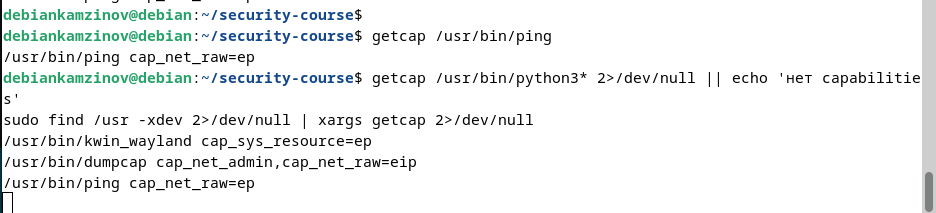

### CapPrm / CapEff / CapBnd — в чём разница

- **CapPrm (Permitted):** Набор разрешённых процессу привилегий. Это жёсткий верхний предел. Процесс не может добавить себе флаг, которого здесь нет.
- **CapEff (Effective):** Набор активных привилегий, которые ядро проверяет в реальный момент времени. Процесс может временно включать и выключать биты из набора Permitted.
- **CapBnd (Bounding):** Ограничивающий набор. Определяет максимальные права, которые процесс может сохранить при запуске другой программы через `execve` или передать дочерним процессам.

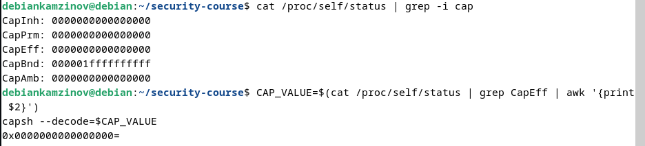

### setcap — демонстрация
**До:** python3 порт 80 → `DENIED: порт 80 - Permission denied`
**После setcap cap_net_bind_service=ep:** → `OSError: [Errno 98] Address already in use` (доступ разрешён, порт занят)

**Почему лучше чем sudo:** `sudo` выдаёт процессу абсолютные права `root` (UID 0) над всей ОС — если в скрипте уязвимость, хост взломан. `setcap` выдаёт строго одно точечное разрешение (привязка к порту), оставляя процесс непривилегированным в остальном.

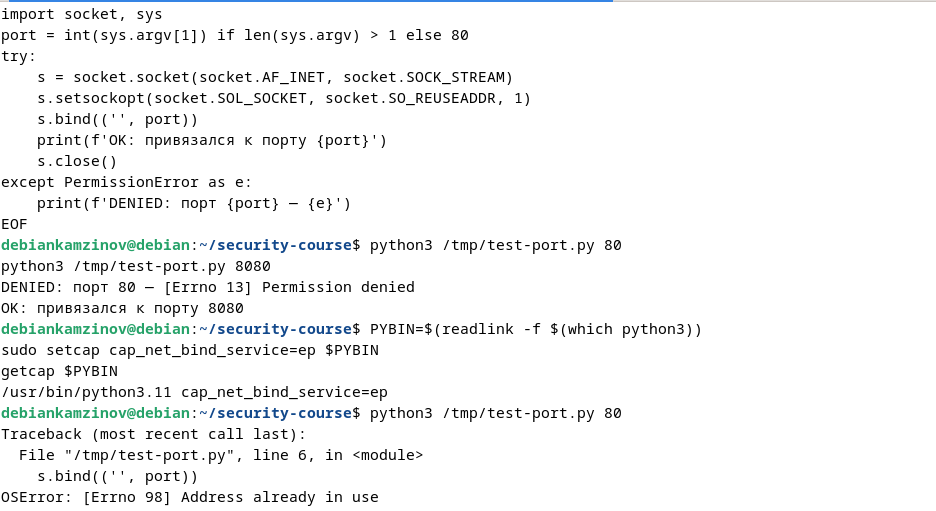

### Флаги e, i, p в cap_net_raw+eip
- **e (Effective):** Привилегия взводится в активное состояние сразу при запуске исполняемого файла
- **i (Inheritable):** Разрешает наследовать данную capability дочерним процессам при вызове `execve`
- **p (Permitted):** Привилегия разрешена для использования и может быть программно активирована процессом в набор Effective

---

## 2. AppArmor

### Количество профилей
enforce: 30, complain: 23 (всего 53 профиля)

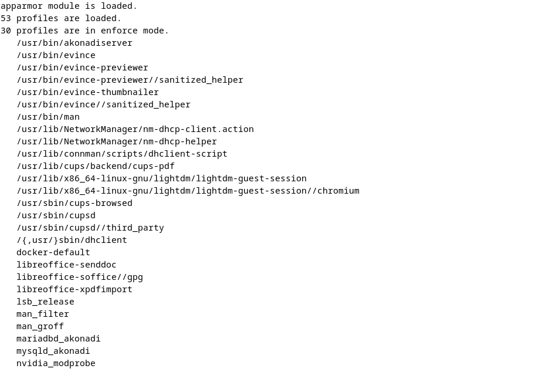

### Результаты pr07-reader

| Действие | Без профиля | complain | enforce |
|---|---|---|---|
| Читать /tmp/pr07-allowed.txt | Разрешено | Разрешено | Запуск запрещён |
| Читать /etc/shadow | Запрещено (DAC) | Запрещено (DAC + лог) | Запуск запрещён |
| Писать в /tmp/ | Разрешено | Разрешено | Запуск запрещён |
| Писать в /etc/ | Запрещено (DAC) | Запрещено (DAC + лог) | Запуск запрещён |

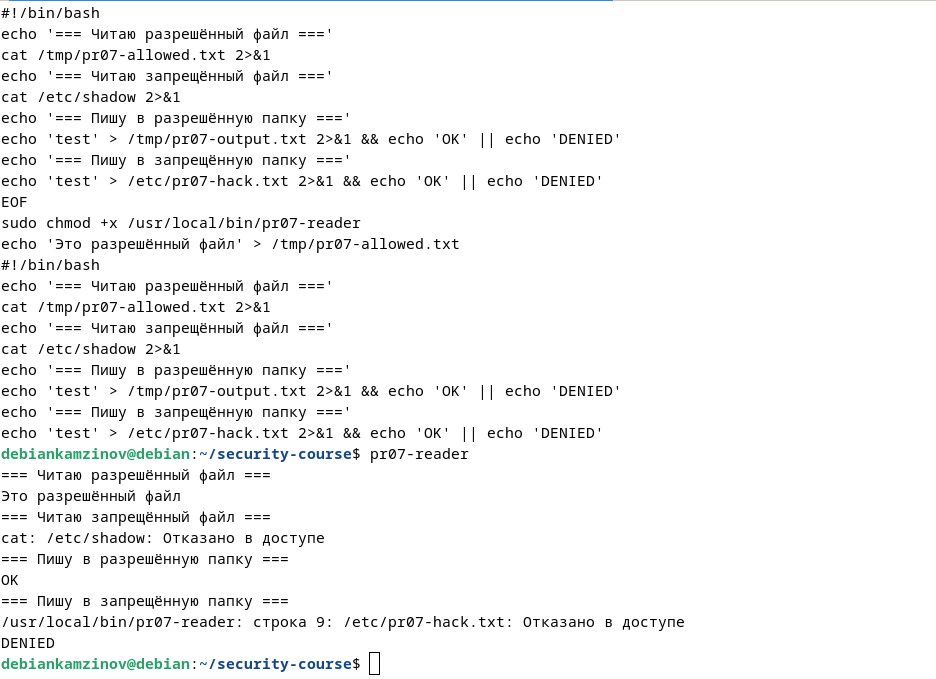
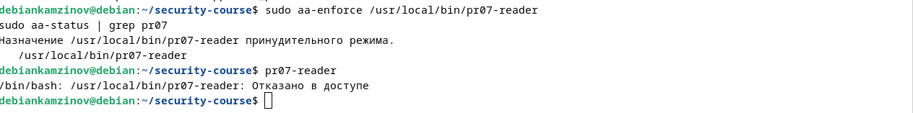

### Разбор строки DENIED
# вставить строку

```
audit(1779500403.084:5): apparmor="DENIED" operation="open" class="file" profile="/usr/local/bin/pr07-reader" name="/etc/shadow" pid=3386 comm="cat" requested_mask="r" denied_mask="r" fsuid=0
```
- `operation` — что делал процесс (open)
- `profile` — какой профиль заблокировал
- `name` — путь к объекту
- `denied_mask` — заблокированное право (r)

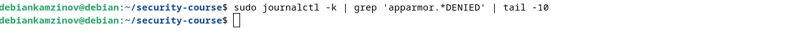

---

## 3. Docker — изоляция

| Ресурс | Хост | Контейнер |
|---|---|---|
| Процессы | 384 шт | 1 шт |
| Сетевые интерфейсы | lo, ens33, docker0 | lo, eth0 |
| /etc/shadow хоста | доступен | недоступен |
| Монтирование | разрешено | запрещено |

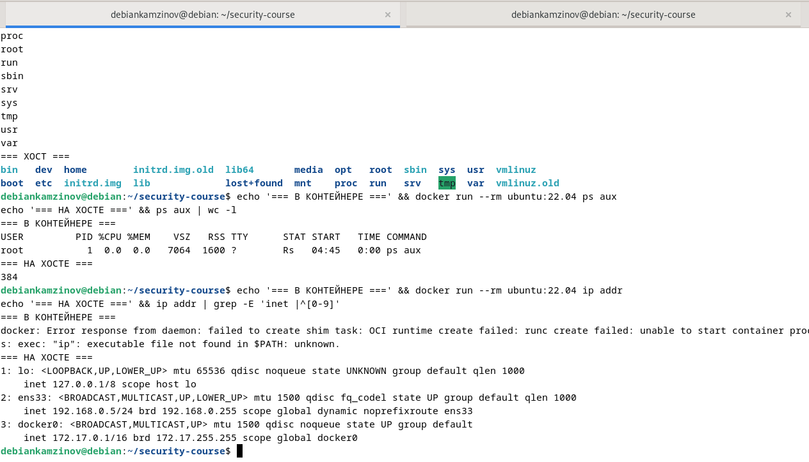
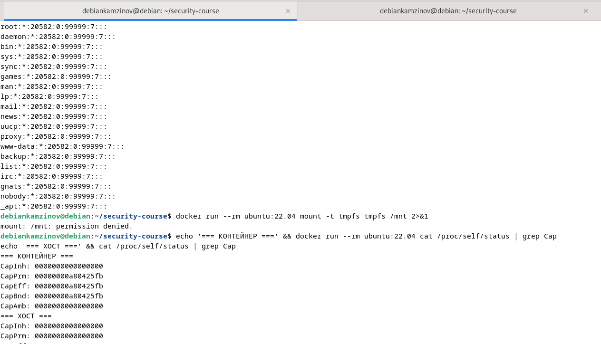

### Capabilities: обычный vs --privileged
**Обычный CapEff:** `000000000a80425fb` → `cap_chown, cap_dac_override, cap_fowner, cap_fsetid, cap_kill, cap_setgid, cap_setuid, cap_setpcap, cap_net_bind_service, cap_net_raw, cap_sys_chroot, cap_mknod, cap_audit_write, cap_setfcap`

**--privileged CapEff:** `0000001fffffffff` → полный набор всех capabilities

**Чего нет у обычного:** `cap_sys_admin`, `cap_net_admin`, `cap_sys_module`, `cap_sys_rawio`, `cap_sys_ptrace`, `cap_sys_boot`

**Почему --privileged опасен:** даёт контейнеру полный root на хосте, доступ к устройствам и возможность побега.


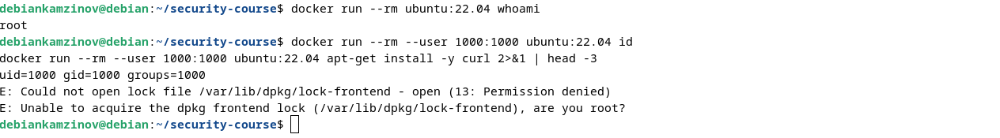

### Итоговый nginx
**Capabilities:** `00000000000004c3` → `cap_chown, cap_dac_override, cap_setgid, cap_setuid, cap_net_bind_service`

**Почему именно эти:** `cap_net_bind_service` для порта 80, остальные — для смены владельца файлов и переключения на www-data.

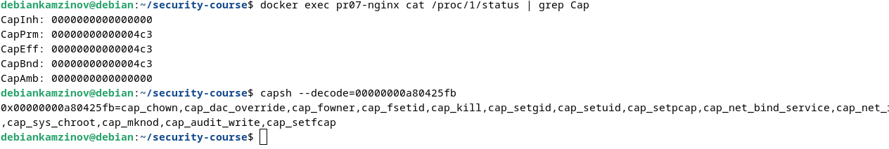

---

## 4. Эшелонированная защита

| Слой | Инструмент | Что ограничивает |
|---|---|---|
| DAC | chmod/chown | Доступ к файлам |
| Capabilities | --cap-drop ALL + cap-add | Системные вызовы к ядру |
| MAC | AppArmor | Мандатный доступ к путям |
| Изоляция | Docker namespaces | Видимость процессов, сети, ФС |

## Выводы

Изучены Linux capabilities (принцип наименьших привилегий), AppArmor (мандатный контроль, режимы complain/enforce) и Docker-изоляция (namespaces, cgroups, --privileged). Настроен безопасный запуск nginx с минимальными capabilities и эшелонированной защитой.

- `operation` — что делал процесс (open)
- `profile` — какой профиль заблокировал
- `name` — путь к объекту
- `denied_mask` — заблокированное право (r)


---

## 3. Docker — изоляция

| Ресурс | Хост | Контейнер |
|---|---|---|
| Процессы | 384 шт | 1 шт |
| Сетевые интерфейсы | lo, ens33, docker0 | lo, eth0 |
| /etc/shadow хоста | доступен | недоступен |
| Монтирование | разрешено | запрещено |


### Capabilities: обычный vs --privileged
**Обычный CapEff:** `000000000a80425fb` → `cap_chown, cap_dac_override, cap_fowner, cap_fsetid, cap_kill, cap_setgid, cap_setuid, cap_setpcap, cap_net_bind_service, cap_net_raw, cap_sys_chroot, cap_mknod, cap_audit_write, cap_setfcap`

**--privileged CapEff:** `0000001fffffffff` → полный набор всех capabilities

**Чего нет у обычного:** `cap_sys_admin`, `cap_net_admin`, `cap_sys_module`, `cap_sys_rawio`, `cap_sys_ptrace`, `cap_sys_boot`

**Почему --privileged опасен:** даёт контейнеру полный root на хосте, доступ к устройствам и возможность побега.


### Итоговый nginx
**Capabilities:** `00000000000004c3` → `cap_chown, cap_dac_override, cap_setgid, cap_setuid, cap_net_bind_service`

**Почему именно эти:** `cap_net_bind_service` для порта 80, остальные — для смены владельца файлов и переключения на www-data.


---

## 4. Эшелонированная защита

| Слой | Инструмент | Что ограничивает |
|---|---|---|
| DAC | chmod/chown | Доступ к файлам |
| Capabilities | --cap-drop ALL + cap-add | Системные вызовы к ядру |
| MAC | AppArmor | Мандатный доступ к путям |
| Изоляция | Docker namespaces | Видимость процессов, сети, ФС |

---

## 5. Выводы

Изучены Linux capabilities (принцип наименьших привилегий), AppArmor (мандатный контроль, режимы complain/enforce) и Docker-изоляция (namespaces, cgroups, --privileged). Настроен безопасный запуск nginx с минимальными capabilities и эшелонированной защитой.

---

## 6. Контрольные вопросы

**1. Чем DAC отличается от MAC? Почему одного DAC недостаточно?**

DAC (Discretionary Access Control) — владелец файла сам управляет доступом через chmod/chown. MAC (Mandatory Access Control) — система управляет доступом по глобальным правилам, не зависящим от владельца. Одного DAC недостаточно, потому что root может обойти любые дискреционные ограничения. MAC добавляет второй барьер, который root тоже не может игнорировать.

**2. Что означает запись cap_net_bind_service=eip? Чем ep отличается от eip?**

- `e` (Effective) — привилегия активна сразу при запуске
- `i` (Inheritable) — привилегия наследуется дочерними процессами при execve
- `p` (Permitted) — привилегия разрешена к использованию

`ep` — без наследования (только текущий процесс). `eip` — с наследованием (дочерние процессы тоже получат эту capability).

**3. В чём разница между complain и enforce в AppArmor? Зачем нужен complain?**

- `enforce` — активно блокирует запрещённые действия и пишет логи
- `complain` — только пишет предупреждения в логи, но НЕ блокирует действия

`complain` нужен для отладки и тестирования профилей: можно запустить приложение, собрать логи о всех его действиях и настроить профиль, не рискуя сломать работу сервиса.

**4. Docker использует то же ядро что и хост — почему тогда контейнер изолирован?**

Изоляция достигается за счёт механизмов ядра Linux:

- **Namespaces** (пространства имён): PID (процессы), NET (сеть), MNT (файловая система), UTS (hostname), IPC (межпроцессное взаимодействие), USER (пользователи)
- **Cgroups** (контрольные группы): ограничение ресурсов (CPU, RAM, дисковый I/O)

Контейнер работает на том же ядре, но видит только изолированный срез ресурсов.

**5. Злоумышленник нашёл RCE в nginx (без --privileged, с --cap-drop ALL --cap-add NET_BIND_SERVICE, под не-root, с AppArmor). Что может и не может сделать?**

**Может:**
- Нарушить логику работы веб-сервера
- Прочитать/изменить файлы внутри контейнера (в пределах прав пользователя nginx)
- Испортить веб-страницы или логи

**Не может:**
- Совершить побег (container escape) на хост-систему
- Прочитать `/etc/shadow` хоста
- Смонтировать файловые системы
- Изменить сетевые настройки хоста
- Получить root-права
- Установить ПО через `apt` (нет прав на запись в системные каталоги)

**6. Почему --privileged — антипаттерн? Когда всё же оправдан?**

**Почему антипаттерн:** Флаг `--privileged` полностью отключает изоляцию Docker. Контейнер получает все capabilities, прямой доступ к устройствам хоста (`/dev/`) и практически не отличается от процесса на хосте. При взломе такого контейнера злоумышленник мгновенно получает полный контроль над хост-системой.

**Когда оправдан:** Только в специфических случаях:
- Docker-in-Docker (DinD) для CI/CD
- Системы оркестрации (Kubernetes) в режиме отладки
- Утилиты для мониторинга и отладки ядра
- Запуск системных сервисов, которым действительно нужен полный доступ к оборудованию

В продакшене `--privileged` использовать категорически не рекомендуется.
