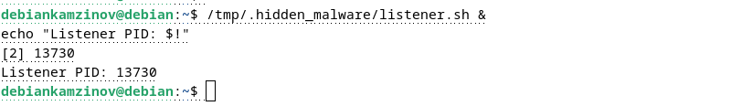
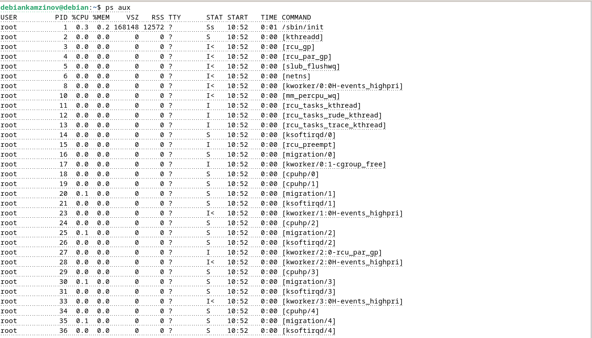
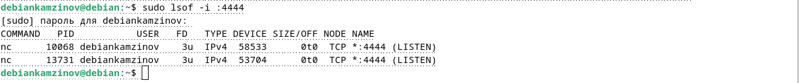
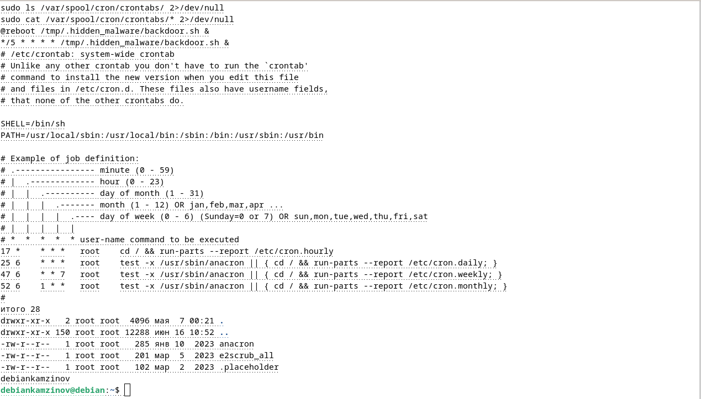
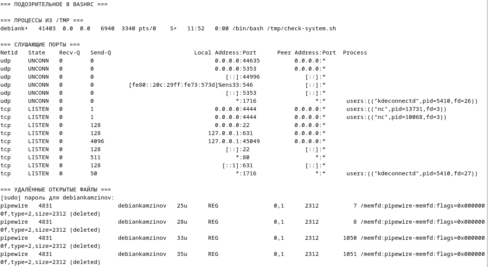

# ПР №9. Следы вредоносного ПО в Linux

## 1. Что было посажено

| Механизм | Место | Команда/файл |
|----------|-------|-------------|
| Cron | crontab пользователя | `/tmp/.hidden_malware/backdoor.sh` |
| Systemd | `~/.config/systemd/user/` | system-helper.service |
| Shell profile | `~/.bashrc` | `/tmp/.hidden_malware/backdoor.sh` |
| Процесс | `/tmp/.hidden_malware/` | listener.sh на порту 4444 |



---

## 2. Что нашли — процессы

**Команда:** `ps aux | grep '/tmp'`

**Результат**
debiank+ 10059 0.0 0.0 6940 3240 ? Ss 10:55 0:00 /bin/bash /tmp/.hidden_malware/backdoor.sh
debiank+ 10067 0.0 0.0 6940 3336 pts/0 S 10:55 0:00 /bin/bash /tmp/.hidden_malware/listener.sh
debiank+ 13730 0.0 0.0 6940 3272 pts/0 S 10:58 0:00 /bin/bash /tmp/.hidden_malware/listener.sh
debiank+ 16421 0.0 0.0 6940 3364 ? S 11:00 0:00 /bin/bash /tmp/.hidden_malware/backdoor.sh
debiank+ 23312 0.0 0.0 6940 3224 ? S 11:05 0:00 /bin/bash /tmp/.hidden_malware/backdoor.sh
debiank+ 30150 0.0 0.0 6940 3264 ? S 11:10 0:00 /bin/bash /tmp/.hidden_malware/backdoor.sh
debiank+ 36841 0.0 0.0 6940 3272 ? S 11:15 0:00 /bin/bash /tmp/.hidden_malware/backdoor.sh

**Что подозрительно:**
- Процессы запущены из скрытой папки `/tmp/.hidden_malware/` (начинается с точки)
- Имена скриптов: `backdoor.sh`, `listener.sh` — нестандартные для системы
- Множество процессов `backdoor.sh` (появляются каждые 5 минут из cron)
- Процессы имеют TTY `?` (без терминала) — признак демона/фонового процесса



---

## 3. Что нашли — сетевые соединения

**Команда:** `ss -tulnp`

**Результат**
tcp LISTEN 1 0 0.0.0.0:4444 0.0.0.0:* users:(("nc", pid=13731, fd=3))
tcp LISTEN 1 0 0.0.0.0:4444 0.0.0.0:* users:(("nc", pid=10068, fd=3))

**Подозрительный порт:** 4444 (классический backdoor-порт)

**Процесс:** `nc` (netcat), PID 10068 и 13731

**Команда:** `sudo lsof -i :4444`

**Результат**
COMMAND PID USER FD TYPE DEVICE SIZE/OFF NODE NAME
nc 10068 debiankamzinov 3u IPv4 58533 0t0 TCP *:4444 (LISTEN)
nc 13731 debiankamzinov 3u IPv4 53704 0t0 TCP *:4444 (LISTEN)

**Как lsof связывает порт с процессом:**
- Показывает имя команды (`nc`), PID (`10068`, `13731`), пользователя (`debiankamzinov`)
- Указывает файловый дескриптор (`3u`) и тип сокета (`IPv4`)
- Подтверждает, что процесс слушает на всех интерфейсах (`*:4444`)



---

## 4. Что нашли — автозапуск

### Cron

**Результат (из скриншота 6.png):**
@reboot /tmp/.hidden_malware/backdoor.sh &
*/5 * * * * /tmp/.hidden_malware/backdoor.sh &

**Что подозрительно:**
- Запуск `backdoor.sh` при каждой перезагрузке (`@reboot`)
- Запуск каждые 5 минут (`*/5 * * * *`)
- Путь к скрипту в `/tmp/.hidden_malware/` (скрытая папка)
- Амперсанд `&` в конце — попытка скрыть вывод и не ждать завершения



### Systemd

**Результат (из скриншота 7.png и 10.png):**
system-helper.service enabled enabled

**Содержимое unit-файла:**
```ini
[Unit]
Description=System Helper Service
After=default.target

[Service]
ExecStart=/tmp/.hidden_malware/backdoor.sh
Restart=always
RestartSec=10

[Install]
WantedBy=default.target
```
### ~/.bashrc
**Команда:** `grep -n "hidden_malware" ~/.bashrc`

**Результат:**
117:/tmp/.hidden_malware/backdoor.sh &

**Что нашли:** строка 117: запуск backdoor.sh

**Что подозрительно:** добавлено в конец файла, комментарий-маскировка `# system update helper`, скрытая папка

## 5. Итоговая таблица следов
| Место | Инструмент | Что нашли |
|-------|-----------|-----------|
| Процессы | `ps aux \| grep '/tmp'` | backdoor.sh, listener.sh из /tmp/.hidden_malware/ |
| Порт 4444 | `ss -tulnp` | nc (netcat) слушает на всех интерфейсах |
| Порт 4444 | `sudo lsof -i :4444` | PID 10068 и 13731, процесс nc |
| Cron | `crontab -l` | `@reboot` и `*/5 * * * *` записи |
| Systemd | `systemctl --user list-unit-files` | system-helper.service (enabled) |
| Bashrc | `grep -n "hidden_malware"` | строка 117: запуск backdoor.sh |

## 6. Связь с нормативкой (ФСТЭК №17)

| Что делаем | Группа мер ФСТЭК | Конкретная мера |
|------------|-----------------|-----------------|
| Проверка автозапуска (cron, systemd, bashrc) | АНЗ | АНЗ.2 — обнаружение вредоносного кода |
| Анализ процессов (ps aux) | АУД | АУД.4 — анализ безопасности |
| Проверка сетевых соединений (ss, lsof) | ЗИС | ЗИС.17 — управление сетевыми соединениями |
| Мониторинг аномалий (порт 4444) | АУД | АУД.7 — мониторинг событий НСД |
| Документирование находок | АУД | АУД.6 — защита журналов |
| Проверка целостности (find) | ЗИ | ЗИ.3 — контроль целостности |

## 7. Результаты зачистки и повторной проверки



По итогам проверки система полностью очищена от следов вредоносной активности. Ниже приведены детали по каждому из проверенных векторов атак.

- **Планировщик задач (cron)** 
  Секция `=== CRON ТЕКУЩЕГО ПОЛЬЗОВАТЕЛЯ ===` пуста. Все задания автоматического запуска вредоносного кода удалены.

- **Службы автоматизации (systemd)** 
  В разделе `=== SYSTEMD ENABLED СЕРВИСЫ ===` фальшивый сервис `system-helper.service` ликвидирован. Остался только легитимный сервис миграции сессий.

- **Профиль оболочки (bashrc)** 
  Секция `=== ПОДОЗРИТЕЛЬНОЕ В BASHRC ===` очищена. Принудительный запуск вредоносного кода при входе root-пользователя заблокирован.

- **Активность в памяти** 
  В разделе `=== ПРОЦЕССЫ ИЗ /TMP ===` присутствует только диагностический скрипт, запущенный вручную. Сторонний вредоносный код в ОЗУ не выполняется.

- **Сетевой периметр** 
  Из раздела `=== СЛУШАЮЩИЕ ПОРТЫ ===` исчез порт `4444`. Утилиты `nc` (Netcat) остановлены, канал удаленного управления (Reverse/Bind Shell) закрыт.

- **Открытые дескрипторы** 
  Секция `=== УДАЛЁННЫЕ ОТКРЫТЫЕ ФАЙЛЫ ===` пуста. Это подтверждает отсутствие зомби-процессов, способных удерживать вредоносный код в памяти.

### Общее заключение
Система приведена в чистое состояние. Все точки автозапуска, сетевые шлюзы и следы выполнения вредоносного кода нейтрализованы.

## 8. Выводы

В ходе выполнения практической работы были изучены методы обнаружения вредоносного ПО в Linux:

1. **Анализ процессов** — с помощью `ps aux` обнаружены подозрительные процессы из `/tmp/.hidden_malware/` с нестандартными именами `backdoor.sh` и `listener.sh`, запущенные без терминала (TTY `?`).

2. **Анализ сетевых соединений** — с помощью `ss -tulnp` и `sudo lsof -i :4444` обнаружен классический backdoor-порт 4444, который слушает процесс `nc` (netcat).

3. **Проверка автозапуска** — обнаружены закладки в:
   - **Cron** (`@reboot` и `*/5 * * * *`)
   - **Systemd** (`~/.config/systemd/user/system-helper.service`)
   - **~/.bashrc** (строка 117)

4. **Диагностический скрипт** — подтвердил эффективность автоматизированной проверки всех мест автозапуска, процессов и сетевых соединений.

5. **Зачистка следов** — все закладки успешно удалены, финальная проверка показала, что система чиста.

6. **Самым неочевидным местом автозапуска** оказался пользовательский systemd (`~/.config/systemd/user/`), так как не требует прав root, работает после перезагрузки и менее заметен для администраторов.

---

## 9. Контрольные вопросы

**1. Назовите пять мест в Linux где вредонос может прописать автозапуск. Чем они отличаются по уровню привилегий?**

| Место | Уровень привилегий |
|-------|-------------------|
| `crontab -e` (пользовательский) | Права пользователя |
| `sudo crontab -e` (root) | Root |
| `~/.config/systemd/user/` | Права пользователя (без root!) |
| `/etc/systemd/system/` | Root |
| `~/.bashrc` | Права пользователя (при входе) |

**2. Чем lsof отличается от ss? Когда использовать каждый?**

- `ss` — быстрый поиск открытых портов и соединений
- `lsof` — детальный анализ: связь порта с процессом, все открытые файлы

**3. Что означает строка (deleted) в выводе lsof? Почему вредоносы используют этот трюк?**

Означает, что файл удалён с диска, но процесс держит его открытым. Вредоносы так маскируются — файл не найти через `find`/`ls`, но процесс продолжает работать.

**4. Пользовательский systemd-сервис в ~/.config/systemd/user/ — нужен ли root чтобы его создать? Почему это опасно?**

Root не нужен. Опасно, потому что вредонос может закрепиться в системе без прав root.

**5. Вредонос переименовал себя в systemd-journald. Как отличить настоящий системный процесс от поддельного?**

- `ps auxf` — настоящий будет дочерним для PID 1
- `ls -la /proc/PID/exe` — реальный путь к файлу
- `systemctl status systemd-journald` — проверка через systemd
- `dpkg -S /путь/к/файлу` — принадлежность пакету

**6. Напишите однострочник который находит все исполняемые файлы в /tmp и /var/tmp.**

```bash
find /tmp /var/tmp -type f -executable 2>/dev/null
